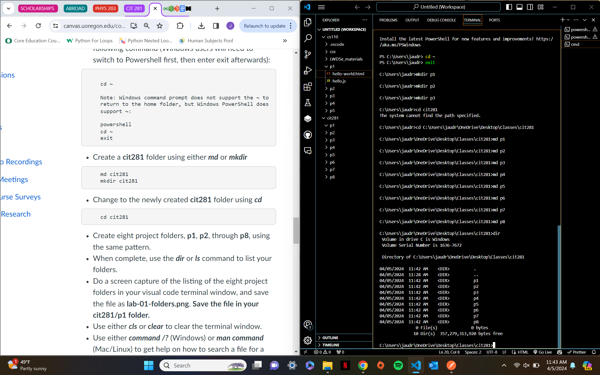

# Lab 1 

## Purpose of the lab
The purpose of this lab was to get used to creating files/ folders and editing these files from the command line. Lab 1 also focused on understanding keyboard shortcuts. 

## Technologies used 
- Javascript
- VS Code

## What I learned from this Lab
During this lab, I learned...
- Lots of Windows commands to use in the command line
- How to run and debug Javascript using Node.js
- Helpful keyboard shortcuts to use when moving around your code

